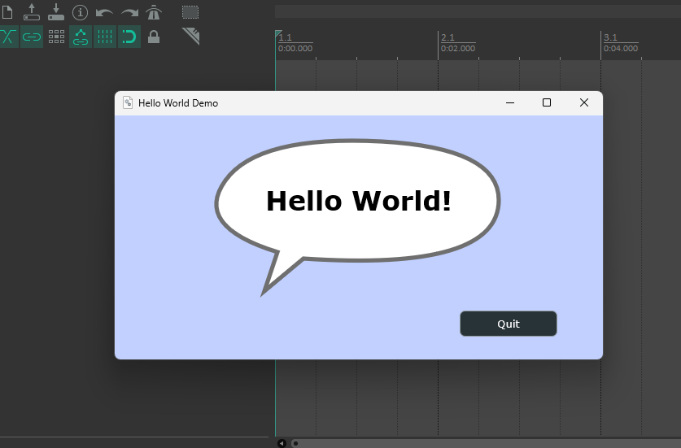

# ReaJoice



A cross-platform [CMake](https://cmake.org) project template for developing [REAPER plugin extensions](https://www.reaper.fm/sdk/plugin/plugin.php) using [JUCE Framework](https://github.com/juce-framework/JUCE).
Based on [ReaPack](https://github.com/cfillion/ReaPack).
See also [JUCE tutorials](https://juce.com/learn/tutorials/).

## Build

Dependencies are fetched from GitHub with CMake `FetchContent` on first configure:

- JUCE
- WDL
- reaper-sdk

Fetched sources are stored in `${CMAKE_SOURCE_DIR}/.deps` by default, so deleting `build/` and reconfiguring does not force redownloading dependencies.

```sh
cmake -B build -DCMAKE_BUILD_TYPE=Release
cmake --build build
```